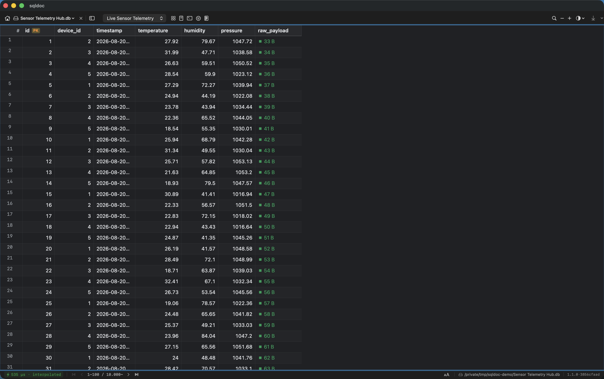

# sqlswift

**A read-only viewer that opens a SQLite database the way a browser opens a web page.**

Drop a `.db` file on it. It opens instantly — no import step, no "loading 2M rows"
spinner, no lock on the file. Scroll a hundred-million-row table as smoothly as a
hundred-row one. Pure Swift 6 and SwiftUI, zero third-party dependencies, one
universal binary.

> Marketing name: **sqldoc** (the app bundle, the CLI, the menu bar).
> Repository name: **sqlswift** (the Swift rewrite of the original Go `sqldoc`).



---

## Why it exists

`sqlswift` is the fourth take on one idea: *look at a SQLite file without
mutating it, without waiting, and without a heavyweight database GUI*. It carries
the best parts of a lineage of prototypes — a Go + WebView viewer, a
"render a database to a shareable HTML page" tool, and a Flutter native-grid app —
into a single native macOS application with no runtime, no embedded browser, and
no dependency graph.

Design stance:

- **Read-only, always.** The file is opened immutable where possible. `sqlswift`
  never writes to your database. The query console runs `SELECT` only.
- **Instant first paint.** Open shows metadata only. The first screen of rows is
  drawn from an interpolated seek; the exact row count settles in the background.
- **Constant-time scrolling.** Keyset pagination, not `LIMIT/OFFSET` — page 1 and
  page 1,000,000 cost the same.
- **The document can describe itself.** Optional `_style` / `_head` / `_nav`
  tables let a database carry its own title, accent color, theme, and table
  ordering.

---

## Install

### The app (recommended)

1. Download `sqldoc-1.1.0-universal.dmg` from the
   [latest release](https://github.com/darianmavgo/sqlswift/releases/latest).
2. Open the DMG and drag **sqldoc** to Applications.
3. First launch: **right-click the app → Open → Open**. This is needed once
   because the build is signed ad-hoc, not notarized (see
   [Gatekeeper](#gatekeeper), below).

### The CLI

```sh
tar xzf sqldoc-cli-1.1.0-macos-universal.tar.gz
sudo mv sqldoc /usr/local/bin/        # or anywhere on your PATH
xattr -d com.apple.quarantine /usr/local/bin/sqldoc   # clear the download flag
sqldoc --version
```

### From source

Requires the Swift 6 toolchain (Xcode 16 / recent Command Line Tools) and macOS 14+.

```sh
git clone https://github.com/darianmavgo/sqlswift.git
cd sqlswift
make app        # builds bin/sqldoc.app + bin/sqldoc
make install    # installs /Applications/sqldoc.app and ~/.local/bin/sqldoc
```

See [`docs/build-config.md`](docs/build-config.md) for how the build works.

---

## Using it

Open a database:

```sh
sqldoc mydata.db                 # opens the app on that file
sqldoc a.db b.db c.db            # multi-database, switch from the sidebar
open -a sqldoc mydata.sqlite     # or just double-click it in Finder
```

Inspect one from the terminal without launching the UI:

```sh
$ sqldoc info testdata/sample.db
testdata/sample.db
1.6 MB · 2026-08-30 08:50 · native libsqlite3

TABLE                        TYPE           ROWS  COLUMNS
------------------------------------------------------------
telemetry                    table       10,000~  7
devices                      table            5~  6
events                       table            5~  5
_nav (meta)                  table            4~  4
_style (meta)                table            3~  2
```

Measure it:

```sh
$ sqldoc bench testdata/benchmark.db
readings · 15 MB · Swift 6 / native libsqlite3
  open (metadata only)          1.89ms
  first window (100 rows)        709µs   [interpolated]
  row count at open                 0s   [estimate: 100,000 rows]
  exact count settled after   353.83ms   [100,000 rows, in the background]
  scroll (keyset, 100 rows)        p50      598µs   p99     4.96ms
  seek to random position          p50      450µs   p99      520µs
```

Export a table:

```sh
sqldoc export mydata.db users users.csv
sqldoc export mydata.db users            # prints CSV to stdout
```

### Command reference

| Command | What it does |
|---|---|
| `sqldoc` | Open the start page (recents, drag & drop) |
| `sqldoc <file…>` | Open one or more databases in the app |
| `sqldoc info <file>` | Print tables, types, row counts, column counts |
| `sqldoc bench <file>` | Measure open latency and scroll throughput |
| `sqldoc export <file> <table> [out.csv]` | Export a table to CSV |
| `sqldoc --version` | Print version |

Flags: `-immutable` (promise the file won't change — fastest cold start),
`-app` (force the desktop UI), `--help`.

---

## Features

**Grid & navigation**
- Keyset (seek-based) scrolling — O(1) at any depth
- Estimate-then-exact row count; O(1) rowid bounds via scalar subqueries
- Background column-width sampling (24-anchor scan), double-click auto-fit,
  persisted widths
- Stable keyset sort with proper numeric ordering
- Compact / Regular / Tall row heights, with text wrap
- Jump-to-row dialog (`⌘L`) — by ordinal or rowid
- Power-2 sampling — spot-check rows at ordinals 1, 2, 4, 8, 16, 32…
- Multi-table gallery view (`⌥⌘G`), collapsible table sidebar (`⌥⌘S`)
- Zoom (`⌘+` / `⌘-` / `⌘0`)

**Find & filter**
- Incremental all-column find with live progress (`⌘F`), case-sensitive toggle
- Column-scoped find; next/prev with the bar closed (`⌘G` / `⌘⇧G`)
- Per-column filter bar — debounced `LIKE` / `=` / `>` / `<` / `IS NULL`

**Inspect**
- Full schema view (`⌘I`): column type, NOT NULL, PK, defaults, foreign keys,
  indexes, and the raw `CREATE TABLE` DDL
- Data inspector: JSON pretty-print, epoch-date detection, hex/binary view
- Smart in-cell formatting: epochs → local datetime, byte counts → `1.4 MB`,
  Unix mode bits → `rwxr-xr-x`
- Read-only query console (`⌘⇧K`) — `SELECT` only, results in the same grid

**Move data out**
- Export or copy a table as CSV, TSV, JSON, SQL `INSERT`, Markdown table, or a
  self-contained HTML page styled from the document's own `_head`
- Copy a row or cell from the context menu
- Open non-SQLite files directly: CSV, TSV, JSON, NDJSON/JSONL (converted to a
  temporary database on the fly)

**Fit & finish**
- Instant first paint with skeleton loading and a busy overlay
- Fast / slow query timing badge
- Manual light/dark override, or match system
- Recents, drag-and-drop, and paste-a-path to open

---

## The self-describing document convention

Any of these optional tables changes how `sqlswift` presents the file. They are
plain SQLite tables — add them with `INSERT` statements, nothing proprietary.

| Table | Purpose |
|---|---|
| `_style` / `_head` | `title`, `accent` (hex), `theme` (`auto`/`light`/`dark`); plus `favicon`, `description`, `author`, `font_family`, `bg`, `text`, `custom_css`, `page_size` — used natively where they apply, and baked into the HTML export otherwise |
| `_nav` | Per-table `label`, `position`, and `hidden` flag for the sidebar |

Tables whose name starts with `_` are treated as metadata and hidden from the
normal table list (still visible via **Show meta tables**).

```sql
CREATE TABLE _style (key TEXT PRIMARY KEY, value TEXT);
INSERT INTO _style VALUES ('title','Sensor Telemetry Hub'), ('accent','#0f9d58'), ('theme','dark');
```

---

## Architecture

```
Sources/
  SQLDocCore/      engine — no UI. Doc, RowReader, Counter, Finder,
                   ColumnSampler, SchemaInspector, Exporter, FileImporter,
                   a thin Swift wrapper over the system libsqlite3
  SQLDocCLI/       the `sqldoc` command
  SQLDocApp/       the SwiftUI app (MVVM): VirtualizedGridView + view models
  ConfigGen/       build-time tool: reads sqldoc.db, emits typed Swift
config/            schema.sql + seed.sql — source of truth for identity,
                   design tokens, keybindings, behavior limits
```

**One config database.** `sqldoc.db` is the authoritative source for the app's
identity (name, version, bundle id), design tokens, keybindings, and behavior
limits. `make generate` reads it and writes typed Swift into
`Sources/SQLDocCore/Generated/`. Change a value in `config/seed.sql`, regenerate,
rebuild — nothing is hardcoded twice. See [`docs/build-config.md`](docs/build-config.md).

**Zero dependencies.** `Package.swift` has an empty `dependencies` array. SQLite
is the system `libsqlite3` via `import SQLite3`.

---

## Gatekeeper

The released binaries are signed ad-hoc (no paid Apple Developer ID, no
notarization). macOS will therefore complain on first launch:

- **App:** right-click **sqldoc.app → Open**, then **Open** in the dialog. Once.
- **CLI:** `xattr -d com.apple.quarantine /path/to/sqldoc`
- Or clear the whole download: `xattr -dr com.apple.quarantine ~/Downloads/sqldoc.app`

The source is here; `make app` produces the identical bundle if you'd rather
build it yourself.

---

## Development

```sh
make build          # debug build
make release         # release build
make test            # run the test runner
make app             # assemble bin/sqldoc.app
make bench           # build + benchmark against testdata/sample.db
make config-check    # CI guard: fail if generated Swift is stale
sh scripts/make_testdata.sh   # regenerate testdata/*.db
```

Contributor notes and conventions live in [`CLAUDE.md`](CLAUDE.md).
Roadmap and feature provenance: [`docs/FEATURE_BACKLOG.md`](docs/FEATURE_BACKLOG.md).

---

## License

[MIT](LICENSE) © 2026 Darian Hickman
